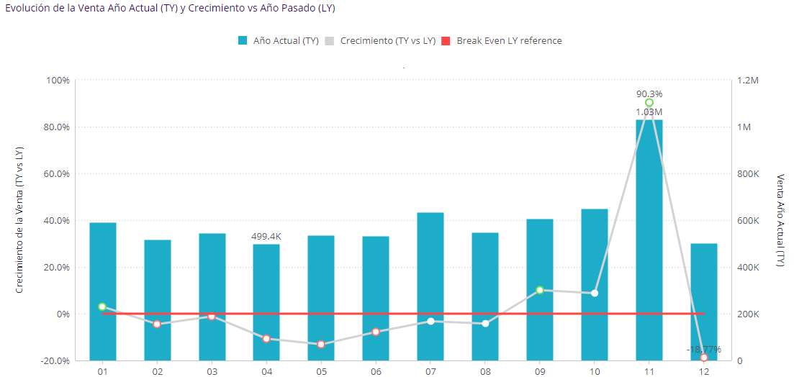
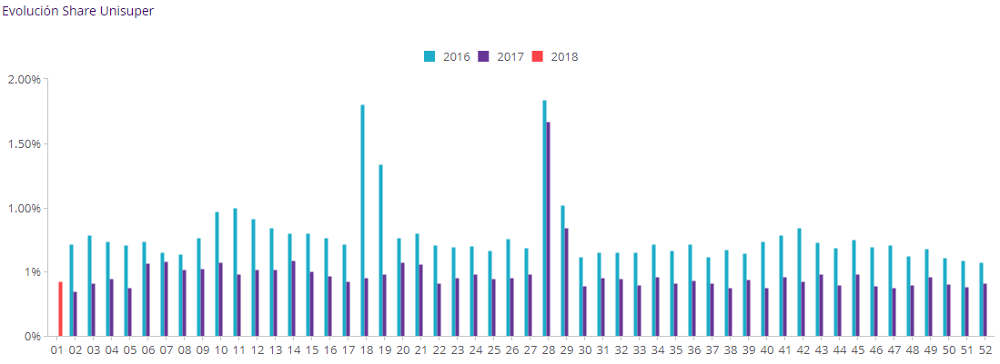
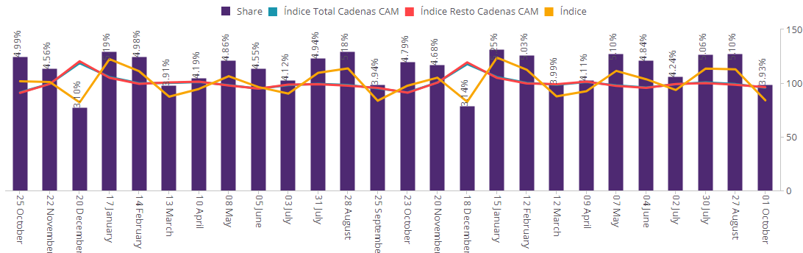
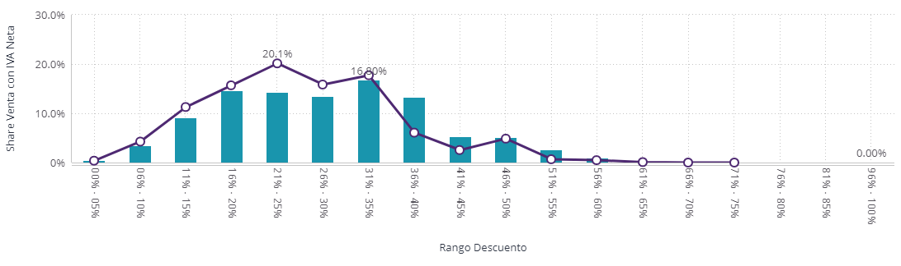
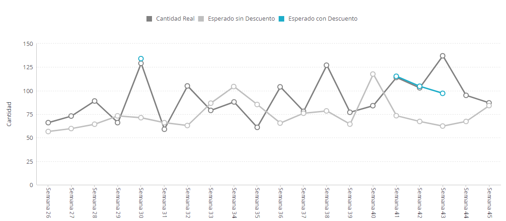
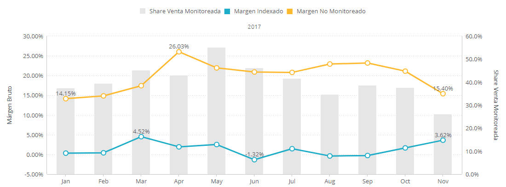
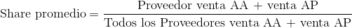
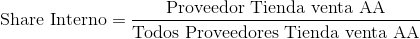
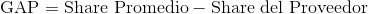
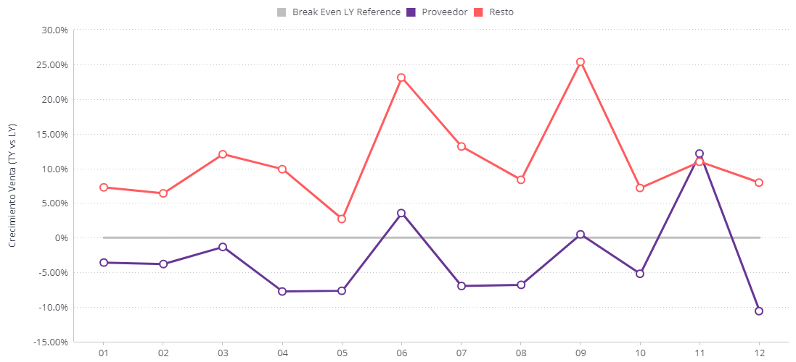

# Plataforma Proveedor de Unisuper

Outline 

- [Data Scan Proveedor](#dsp_pos)

- [Share Unisuper](#share_uni)

- [Share Externo](#share_ext)

- [Análisis de Promociones](#promo_ana)

- [Desempeño de Promociones](#promp_des)

- [Margen Indexado](#margen_ind)

- [Análisis de GAPs](#gaps)

- [Inventarios](#inventarios)

- [Fill Rates](#fill_rate)

  ​

## Data Scan Proveedor 

Características: 
* Detalle de la venta POS por artículo, tienda y proveedor.
* Con información diaria y actualizado hasta dos días atrás.
* En este capítulo se podrá analizar la venta en monto (sin IVA) y en unidades, apoyados de los filtros de Calendario, el cual permite escoger entre el calendario gregoriano o el calendario unisuper. También se cuenta con filtros de clasificación según el tipo o ubicación de las tiendas, y filtros del árbol de surtido de categoría a marca. 
* En este capítulo se encontrará información de ventas anuales, mensuales o diarios, crecimientos y variación contra año anterior, según la Categoría, Marca, Producto, y Tienda, así como también el detalle por producto. 

[volver al outline](#outline)

## Share Unisuper 

* En este capítulo se podrá analizar la participación, de una, algunas o todas las categorías de un proveedor o de proveedores afines. 
* Esto podrá hacerse a nivel de Categoria o Producto, o según la Tienda. Ver su evolución, y una evaluación del crecimiento y variación respecto al año anterior, ver qué marcas o proveedores han tenido crecimiento, no sólo de sí mismos sino contra la categoría a la que pertenecen. En términos de productos podrá encontrar a aquellos que hayan tenido mayor crecimiento o quienes tienen mayor venta. 
* Con información diaria y actualizado hasta dos días atrás.

[volver al outline](#outline)

## Share Externo 

  En este capítulo encontrará los Reportes Nielsen

  * Tendencial
  * Crecimiento
  * RDR
  * Total Store
        * Share, índices, y crecimientos
        * Demanda y Share PDV

[volver al outline](#outline)

## Análisis de Promociones 

  En el capítulo de Promociones contrará la participación de los productos ofertados (con iva), tanto aquellos cuya oferta fue anunciada como de los que no (internos). 

  Podrá ver la evolución semanal de la participación de las ventas de los productos ofertados, según su categoría, marca, tienda, además de la  distribución según el tipo de oferta, y el descuento promedio.

[volver al outline](#outline)

## Desempeño de Promociones 

En este capítulo se utilizan herramientas de análisis matemático para evaluar el rendimiento de los descuentos realizados. Según la historia del descuento de un producto, se tiene el rango de unidades vendidas que debieron tenerse, comparando contra el resultado real. 

[volver al outline](#outline)

## Margen Indexado 

En este capítulo podrán compararse los índices de márgenes del proveedor contra los de proveedores afines, teniendo como base los precios monitoreados de estos últimos. Podrá verse la evolución del índice, del margen bruto, y de la participación de las ventas. 

Este análisis podrá verse a nivel de marca, categoría, o subcategoría.

[volver al outline](#outline)

## Análisis de GAPs 

En este capítulo podrá analizarse y compararse el crecimiento y las oportunidades de participación del proveedor según los proveedores afines, en base a las ventas. 

Se cuenta con la opción de ver las ventas con o sin IVA.

En este capítulo encontrará terminología importante de las que resaltamos

* *Share promedio*: Basado en las ventas del año actual y del año anterior de un Proveedor comparado contra las ventas, en el mismo período, de todos los proveedores

  

  donde AA y AP se refiere a Año Actual y Año Pasado, respectivamente.

* *Share Interno*: Es el Share del Proveedor para una tienda comparada contra el Share Promedio

  

* *GAP*: Es la diferencia de los Share Promedio y Share del Proveedor

  

[volver al outline](#outline)

## Inventarios  

[volver al outline](#outline)

## Fill Rate 

[volver al outline](#outline)

